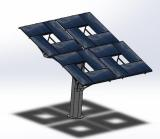
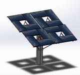
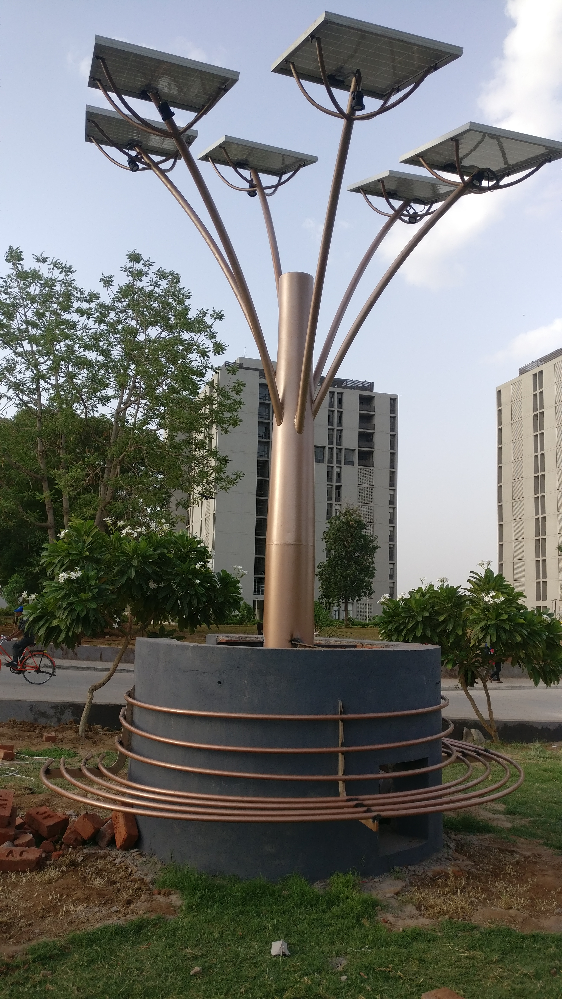

## Academic Experience

### Research Assistant - PhD Candidate (Jan 2021 – Present)

_University of Alberta, Edmonton, Alberta, Canada_

- Thesis Title: **Wake transitions and interactions behind wall-mounted bluff bodies**.
- Study of bluff body wakes, vortex dynamics and vortex interactions using Computational Fluid Dynamics (CFD)
- Expertise in Direct Numerical Simulations (DNS) and Large Eddy Simulations (LES).
- Software: OpenFOAM, ANSYS, COMSOL Multiphysics, Python, MATLAB, Tecplot, and ParaView.

### Research Associate (Sept 2020 – Dec 2020)

_University of Alberta, Edmonton, Alberta, Canada_

- Research Topic: **Response of Viscoelastic turbulent pipeflow past square bar roughness**.
- CFD simulations of non-Newtonian, Viscoelastic and turbulent flow inside a pipe with a roughness element using Ansys, OpenFOAM.
- Expertise in modeling non-Newtonian and viscoelastic fluid flow using Direct Numerical Simulations in OpenFOAM.

### Research Assistant - M.Sc. Candidate (Sept 2018 – Sept 2020)

_University of Alberta, Edmonton, Alberta, Canada_

- Thesis Title: Response and Recovery of turbulent pipeflow past squarebar roughness elements.
- Study of pipeflow dynamics using Computational Fluid Dynamics. 
- Expertise in Reynolds-Averaged Navier-Stokes (RANS) based turbulence modeling and Direct Numerical Simulations (DNS). 
- Software: OpenFOAM, ANSYS, MATLAB, Tecplot, and ParaView.

## Work Experience

### Laboratory Administrator/Manager (Jan 2022 – Aug 2024)

_Computational Fluid Engineering Laboratory (University of Alberta)_

- Updated and maintained the computational facilities at Computational Fluid Engineering Laboratory.
- Designed, Assembled, and tested three high-performance computing (HPC) workstations for research purposes.
- Successfully secured **$\approx$ \$200k in funding** for the research group to access fast compute resources on the **Digital Research Alliance of Canada** Computing clusters.
- Led the proposal writing and submission process, demonstrating strong grant writing skills.
- Expertise in Linux, Windows, and MacOS operating systems.
- Experience in managing and troubleshooting HPC clusters and workstations.

### Engineering Research Safety Associate (August 2021 - Aug 2024)

_University of Alberta (Dept. of Mechanical Engineering)_

- Developed and implemented comprehensive safety protocols for engineering research projects, ensuring compliance with HSE and institutional guidelines.
- Conducted regular risk assessments and safety audits, identifying potential hazards and implementing corrective actions to mitigate risks.
- Provided hands-on training and safety workshops to researchers, enhancing the overall safety culture within the research group.
- Collaborated with cross-functional teams, including researchers, lab managers, and administrative staff, to integrate safety considerations into all phases of research and development.
- Monitored and reported on key safety performance indicators, contributing to the continuous improvement of safety practices and procedures.
- Maintained and updated safety documentation, ensuring accurate and up-to-date records for regulatory compliance.

### Product Design Intern (Mar 2018 – Aug 2018)

_PDPU Innovation AND Incubation Centre, Gandhinagar, Gujarat, India_

- Partnered with Imagine PowerTree and Olive Turtle, contributing to design ideation and product development.
- Utilized SolidWorks and ANSYS for the design and optimization of over 50 components, demonstrating proficiency in 3-D Computer-Aided Design and Finite Element Analysis.
- Led the design of a 6000W self-sustaining urban solar project, integrating a small-scale reverse osmosis plant and a street lighting system.
- Ensured final designs met ISO standards and manufacturability requirements; collaborated on product prototyping.
- Received commendations from company leaders and team members for exceptional design skills and strong communication abilities.

  

### Product Design Intern (May 2017 – Sept 2017)

_TopSun Solar Energy Pvt. Ltd._

- Completed a four-month technical internship under the guidance of the Plant Technical Manager, gaining hands-on experience in the Quality Assurance department.
- Received commendation from the Managing Director for the final internship presentation.

## Extracurricular work experience

### Albertaloop (January 2020 - September 2020)

_Aero/Structural Team Member_

- Member of a student team competing in the 2021 SpaceX Hyperloop Pod competition.
- Conducted aerodynamics simulations and design optimizations of the Hyperloop Pod using CFD and CAD modeling.
- Utilized compressible fluid dynamics solvers and buoyancy-driven flow solvers in OpenFOAM and ANSYS for flow simulations.

### Team Jaabaz, BAJA-Society of Automotive Engineers (SAE), India Team (November 2014 - August 2017)

_Technical Team Leader / Head of Design Department_

- Led a team of 22 undergraduates in designing and manufacturing a single-seater all-terrain vehicle for BAJA SAE competitions.
- Served as Head of the Design Department and Technical Team Leader, managing a subgroup of 20+ individuals.
- Contributed to design and manufacturing processes, gaining experience with CNC, lathe, milling, welding, and composite material fabrication.
- Designed and manufactured the vehicle chassis and ergonomics.
- Represented VIT University and India in BAJA SAE competitions in Tennessee (2016) and California (2017).
  - Achieved 10th place in Design Event and 48th overall at BAJA SAE Tennessee 2016.
  - Secured 27th overall and 14th in Design Event at BAJA SAE California 2017.
- Led the Design Event presentations at both Tennessee 2016 and California 2017 competitions.

